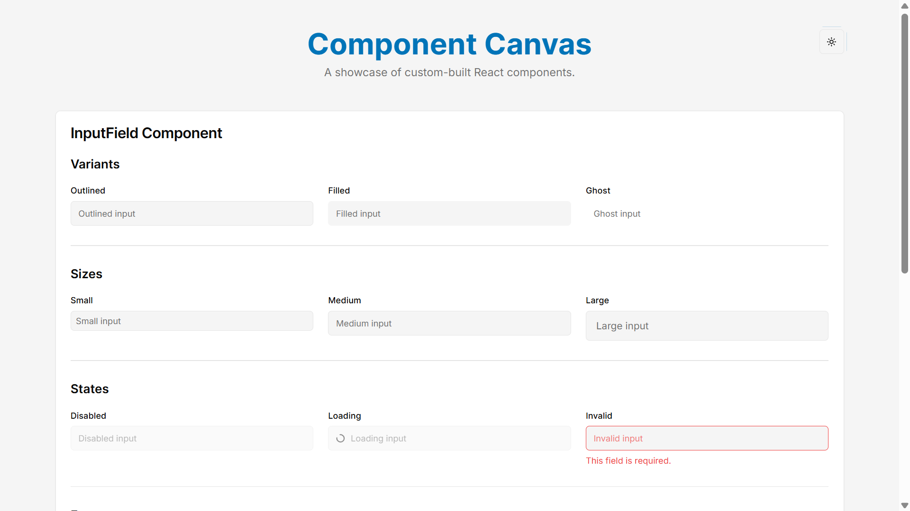
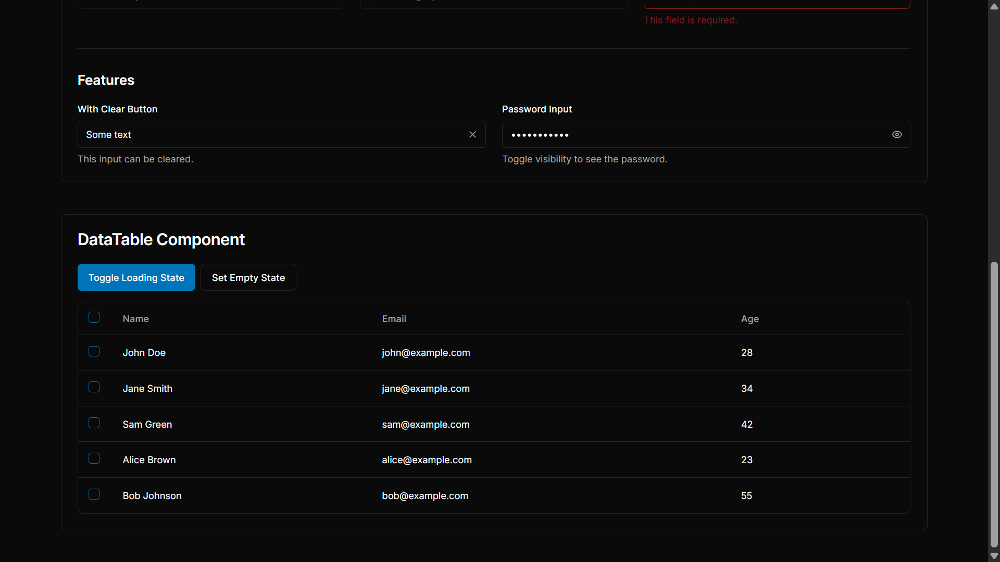

# Component Canvas: A React Component Showcase


This project is a submission for the React Component Development Assignment. It features two main components, an `InputField` and a `DataTable`, built with React, TypeScript, and modern development practices.

## ✨ Live Demo & Storybook

- **Live Application:** [Go Live](https://component-canvas.vercel.app/)
- **Storybook:** [Storybook Live](https://component-canvas-g7su.vercel.app/)

## 🎬 Showcase

### InputField States & Variants



### DataTable Interactivity



## ✅ Features

### InputField Component

- [x] Text input with label, placeholder, helper text, and error message
- [x] **States:** disabled, invalid, loading
- [x] **Variants:** filled, outlined, ghost
- [x] **Sizes:** small, medium, large
- [x] **Features:** Clear button and password visibility toggle
- [x] **Theming:** Supports both light and dark modes.

### DataTable Component

- [x] Displays generic tabular data (`<T>`)
- [x] Column sorting (ascending/descending)
- [x] Row selection with checkboxes
- [x] Loading state with skeleton placeholders
- [x] Empty state for when no data is available

## 🚀 Getting Started

Follow these instructions to get the project running on your local machine.

### Prerequisites

- Node.js (v18 or later)
- npm or yarn

### Installation

1.  **Clone the repository:**

```bash
   git clone https://github.com/deepakpatil26/component-canvas.git
   cd component-canvas
```

2.  **Install dependencies:**

```bash
    npm install
```

### Available Scripts

- **Run the development server:**

```bash
  npm run dev
```

The application will be available at `http://localhost:9002`.

- **Run tests:**

```bash
 npm run test
```

- **Run Storybook:**

```bash
  npm run storybook
```

Storybook will be available at `http://localhost:6006`.

## 🛠️ Approach and Design Choices

### Component Design

- **`InputField`**: This component was built from the ground up to be highly flexible. It leverages `cva` (class-variance-authority) to manage its numerous variants and sizes, making it easy to extend. State management (e.g., for the password toggle) is handled internally with `React.useState`.

- **`DataTable`**: This component is designed to be generic and type-safe, using TypeScript generics (`<T>`) to handle any data structure. It includes features like sorting and row selection. It is built upon the ShadCN `Table` component for a solid structural and stylistic foundation.

### Styling

- **TailwindCSS**: Used for all styling to allow for rapid UI development and maintain a consistent design system.
- **ShadCN UI**: Leveraged for its accessible and unstyled component primitives, which serve as a base for the custom components.
- **Dark Mode**: Implemented using `next-themes`, allowing for easy styling with Tailwind's `dark:` variants.

### Accessibility

Basic accessibility has been addressed by:

- Using semantic HTML elements.
- Adding `aria-*` attributes for states like `aria-invalid` and `aria-label` for interactive elements to ensure they are understandable by screen readers.
